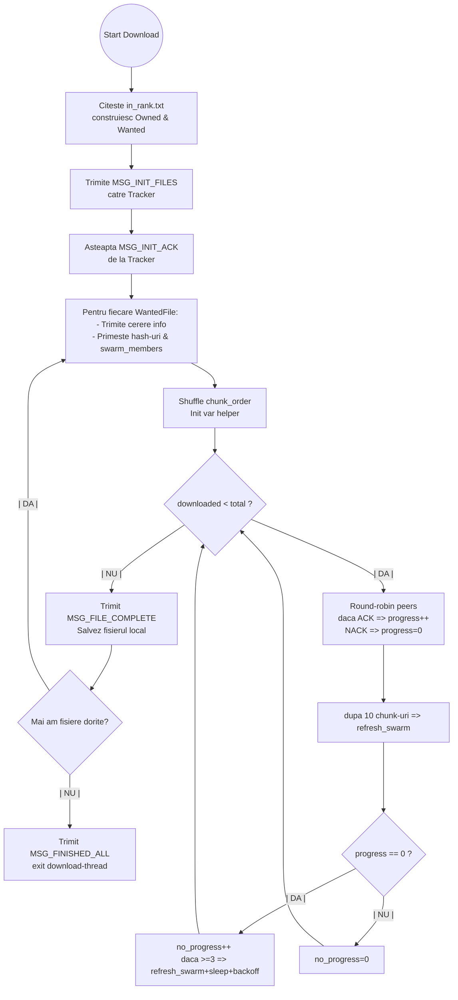
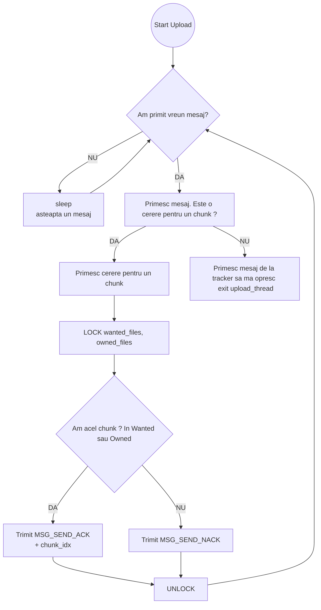
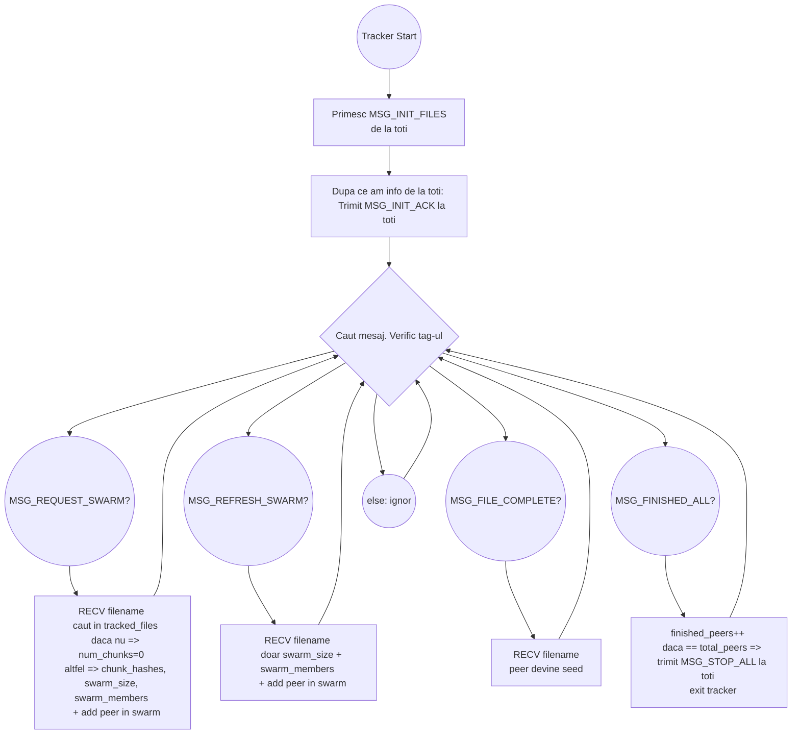

# BitTorrent MPI

## Descriere

Am implementat un BitTorrent folosind MPI si C (pthreads).

Pentru diagramele din acest README, am folosit [Mermaid Live
Editor](https://mermaid-js.github.io/mermaid-live-editor/) si ghidul [Mermaid
Docs](https://mermaid.js.org/intro/).

## Flow-ul programului

Pentru fiecare client (peer) avem 2 thread-uri :

- Download

- Upload

Tracker-ul are un singur thread:

## Solutia eficienta

### Randomizare chunk-urilor

Am folosit un simplu shuffle pentru a diminua sansa unei coliziuni, in care 2
sau mai multi clienti se lupta pentru acelasi chunk.

Am folosit algoritmul Fisher-Yates pentru a efectua shuffle-ul.

### Round-robin

Cand aleg ce peer sa intreb, folosesc o metoda rotativa prin formula

`peer_index = (chunk_index + attempt) % swarm_size`

Astfel ca nu aleg tot timpul acelasi peer pentru cererea de chunk.

Daca am un fisier cu 5 chunk-uri si am 3 peers, se va alege asa daca eu vreau
chunk-ul 2:

Continua doar daca nu primeste ACK.

| attempt | formula                 | peer rezultat |
|---------|-------------------------|---------------|
| 0       | $peer = (2+0) \% 3 = 2$ | 2             |
| 1       | $peer = (2+1) \% 3 = 0$ | 0             |
| 2       | $peer = (2+2) \% 3 = 1$ | 1             |
| 3       | $peer = (2+3) \% 3 = 2$ | 2             |
| 4       | $peer = (2+4) \% 3 = 0$ | 0             |
| ...     | ...                     | ...           |

### Refresh in functie de progres & backoff time

Pe langa criteriul de refresh la fiecare 10 segmente descarcate, am decis ca
daca exista foarte multe coliziuni, sau nu am un peer/seed cu care pot comunica
atunci am 2 optiuni:

1. Intreb tracker-ul daca nu cumva a mai venit un peer care s-ar putea sa aiba
     chunk-urile pe care le caut => `refresh`

2. Pot lua un mic repaus pentru a nu mai contribui la "furtuna" de cereri => `usleep`

Timpul va creste atat timp cat tot nu se observa progres (raspuns ACK la
cerere), dar nu va depasi o secunda, pentru ca avand in vedere ca doar transmit
ACK/NACK ar fi deja ineficient. Astfel timpul incepe de la 0.1s si creste pana
la maxim 1s (daca e cazul).

Astfel se opreste efectul de starvation (dpdv. al clientului care cere) si este
posibil ca un peer sa obtina chunk-urile pe care le vrea alt client si atunci
comunicarea poate evita suprasolicitarea unui seed (ex test1 unde clientul 1
este seed pentru 2 fisere foarte cautate).

In plus, avand in vedere ca `upload_thread` asteapta doar 1ms intre primirea
mesajelor poate insemna ca alt peer poate primi foarte multa ACK-uri de care si
clientul care doarme se poate folosi ulterior.

## Metode de sincronizare

### Structura PeerState

Pentru a putea partaja date intre cele doua thread-uri, am folosit o structura
care detinea informati despre starea peer-ului => PeerState :).

### Mutex care protejeaza accesul la have_chunk

Pentru a ma asigura ca nu citesc in timp ce scriu pentru un client, am protejat
have_chunk cu un mutex.

Astfel ca:

- Atunci cand `upload_thread` verifica daca are sau nu acel chunk, asteptam mai
  intai sa avem mutex-ul
- Cand primesc datele de la tracker despre `WantedFile` le primesc intr-un mod
  blocant pentru a asigura corectitudinea
- In bucla din `download_thread` verific valoarea din array folosind mutex-ul
  pentru a sti la acel moment ca sigur nu este scris.
- Cand primesc raspunsul de la peer, scriu in mod blocant

### MPI_Iprobe

Am decis ca am nevoie de ceva nonblocant, pentru ca ritmul comunicarii este mult
mai rapid si nu am vrut sa am sanse de deadlock si nu era in regula ca
vreun thread doar sa ramana blocat.

Folosind `MPI_Iprobe(src, tag, comm, &flag, &status)` pot instataneu sa vad daca
este vreun mesaj pentru `upload_thread` sau `tracker`. Un fel de polling, as
putea spune.

Daca nu exista vreun mesaj, de ex. cand `upload_thread` si `tracker` comunica la
inceput, am decis sa fac sleep-uri minuscule (1ms) pentru a nu avea probleme de
sincronizare (ce vreau sa spun este ca am incercat fara sleep si se bloca).
